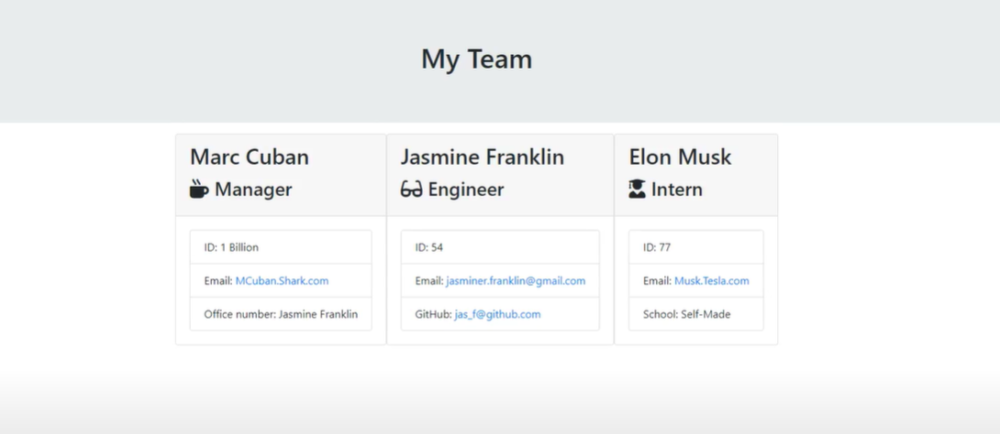

# team-profile-generator
As an owner I want to generate a webpage that displays my team's basic info so that I have quick access to emails and GitHub profiles

<br>

==========


## Create Base Class

```
class Employee {
    constructor (name, id, email) {
        this.name = name
        this.id = id
        this.email = email
    }

    getName() {
        return this.name
    }

```
<br>

## Build Team

```
function buildTeam() {
    const newPage = render(team);
    fs.writeFile(outputPath, newPage, function(err){
        if (err) {
            console.log(err);
        }
    });
```
<br>

## Create Team

```
function createTeam() {
    inquirer.prompt([
        {
            type : 'list',
            name : 'employeeChoice',
            message : 'Which type of employee would you like to add',
            choices : ['Manager','Engineer', 'Intern', 'No more member to add']
        }
    ]).then(answer => {
        switch(answer.employeeChoice){
            case 'Manager':
                createManager()
                break;

            case 'Engineer':
                createEngineer()
                break;

            case 'Intern':
                createIntern()
                break;

            default:
                buildTeam()
        }
```

<br>

## Built With

* [HTML](https://developer.mozilla.org/en-US/docs/Web/HTML)
* [Javascript](https://developer.mozilla.org/en-US/docs/Web/JavaScript)
* [Node]


## Deployed Link

* [See Walk Through](https://drive.google.com/file/d/1eR0zT-F6Htz8KhhYQt19EksU9TUQCGGF/view)
* [See Deployed Link](https://jas-f.github.io/team-profile-generator/.)

## License

This project is licensed under the MIT License 

See also the list of [contributors](https://github.com/your/project/contributors) who participated in this project.

## Prerequisites

Git hub,
Git lab,
Git bash,
Visual studio,
Google chrome,
Bootstrap,
JavaScript
Node
## Authors

**Jasmine Franklin C: 301-332-2313 E: jasminer.franklin@gmail** 

- [Link to Portfolio Site](https://jas-f.github.io/responsive-portfolio/)
- [Link to Github](https://github.com/)
- [Link to LinkedIn](https://www.linkedin.com/in/jasmine-franklin-8b08ba121)

<p>&copy; UC Berkeley Extension Bootcamp.</p>
